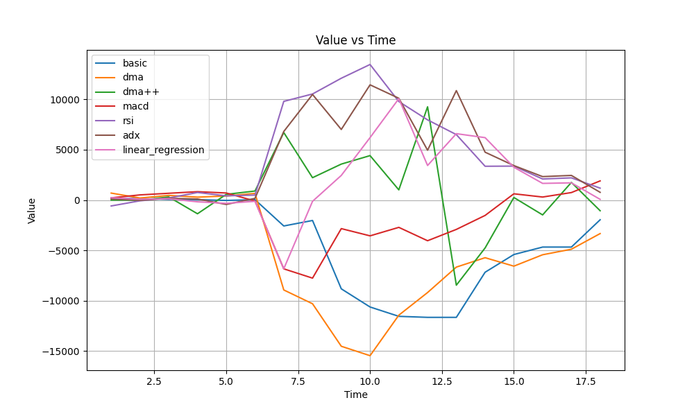
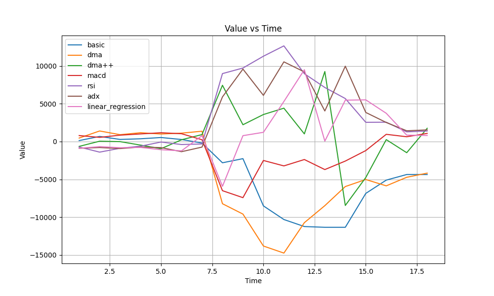
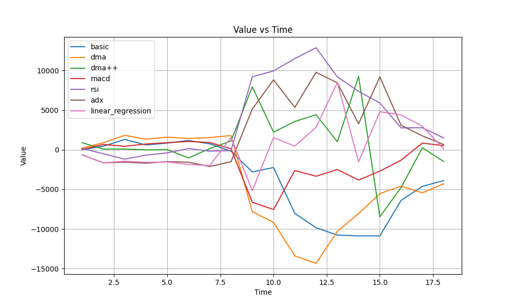
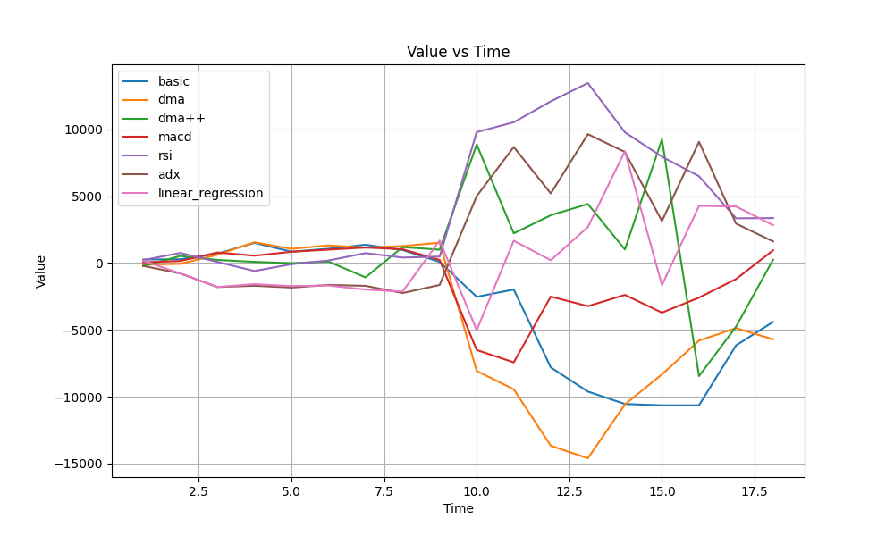

# Trading Strategies Analysis and Comparison

In this document, we analyze and compare various trading strategies implemented for stock market analysis and decision-making.

## Strategies Overview

### 1. Basic Strategy
- Observes price series for the past `n` days.
- Buys 1 share if the price has been monotonically increasing for the last `n` days.
- Sells 1 share if the price has been monotonically decreasing for the last `n` days.

### 2. n-Day Moving Average (DMA)
- Extends basic strategy by using the average price of the last `n` days (DMA).
- Buys if current price > DMA by ≥ `p` standard deviations, sells if current price < DMA by ≥ `p` standard deviations.

### 3. Improved DMA with Stop-Loss and Adaptive Moving Average (AMA)
- Incorporates stop-loss and adaptive moving average.
- Stop-loss closes positions after max hold days if unable to close otherwise.
- Adaptive moving average (AMA) dynamically adjusts based on efficiency ratio.
- Buys when price > AMA by ≥ `p`%, sells when price < AMA by ≥ `p`%.

### 4. MACD (Moving Average Convergence Divergence)
- Uses exponential weighted means to calculate MACD and Signal Line.
- Buys if MACD > Signal, sells if MACD < Signal.

### 5. Relative Strength Index (RSI)
- Calculates RSI based on average gain and loss over the last `n` days.
- Generates buy signal if RSI crosses below oversold_threshold, sell signal if RSI crosses above overbought_threshold.

### 6. ADX (Average Directional Index)
- Calculates ADX based on true range, directional movements, and DX.
- Generates buy signal if ADX > adx_threshold, sell signal if ADX < adx_threshold.

### 7. Linear Regression for Stock Price Prediction
- Predicts stock price using linear regression.
- Buys if predicted price > actual price by ≥ `p`%, sells if predicted price < actual price by ≥ `p`%.

### 8. Mean-Reverting Pairs Trading Strategy
- Uses spread between prices of a pair of stocks.
- Buys spread if z-score < -threshold, sells spread if z-score > threshold.

### 9. Stop-Loss in Pairs Trading Strategy
- Implements loss-based stop-loss in pairs trading strategy.
- Closes position when z-score crosses stop_loss_threshold.
## Graphical Analysis
- **SBIN**:
|  |  |
|:--:|:--:|
| 01-01-2021 | 01-01-2022 |

  

    
    
01-01-2021

  

  

    
    
01-01-2022

  

  

    
    
01-01-2019

  

  

    
    
01-01-2020

  

## Analysis and Insights

- **Performance Evaluation**: 
  - Each strategy's performance can be evaluated based on metrics such as profit/loss, Sharpe ratio, maximum drawdown, etc.
  - Backtesting with historical data can provide insights into the effectiveness of each strategy.
  
- **Risk Management**:
  - Strategies like stop-loss and position constraints help manage risk and limit losses.
  - Incorporating risk-adjusted returns can provide a more comprehensive assessment of strategy performance.
  
- **Market Conditions**:
  - Different strategies may perform better under different market conditions.
  - Strategies relying on trend-following (e.g., DMA, MACD) may perform well in trending markets, while mean-reverting strategies (e.g., RSI, Pairs Trading) may perform better in ranging markets.
  
- **Complexity vs. Robustness**:
  - More complex strategies like linear regression may require more computational resources and data, but may also provide more robust predictions.
  - Simpler strategies like basic DMA may be easier to implement and interpret but may lack sophistication in capturing market dynamics.

## Comparison

- **Performance**: Compare performance metrics (e.g., returns, Sharpe ratio) across different strategies.
- **Risk Management**: Assess the effectiveness of risk management measures in each strategy.
- **Market Adaptability**: Evaluate how well each strategy adapts to different market conditions.
- **Computational Complexity**: Compare computational resources required for implementing and running each strategy.

## Recommendations

- **Diversification**: Consider using a combination of strategies to diversify risk and capture opportunities across different market conditions.
- **Continuous Monitoring**: Regularly monitor and reassess strategy performance to adapt to changing market dynamics.
- **Parameter Tuning**: Optimize strategy parameters based on historical data and performance metrics.
- **Backtesting**: Conduct thorough backtesting before deploying any strategy in live trading to understand its performance and risks.
